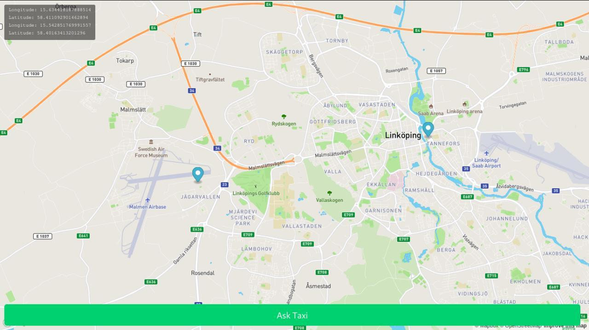

# MapBox Web Example

 A web page to select the origin and destination location for requesting a taxi. 

### MapBox

- https://docs.mapbox.com/mapbox-gl-js/example/measure/
- https://docs.mapbox.com/api/navigation/#directions-response-object
- https://docs.mapbox.com/help/tutorials/getting-started-directions-api/

---------

# Max Base

My nickname is Max, Programming language developer, Full-stack programmer. I love computer scientists, researchers, and compilers. ([Max Base](https://maxbase.org/))

## Asrez Team

A team includes some programmer, developer, designer, researcher(s) especially Max Base.

[Asrez Team](https://www.asrez.com/)

